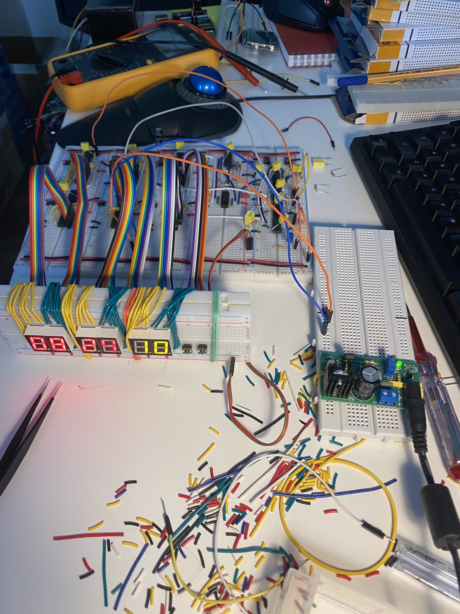
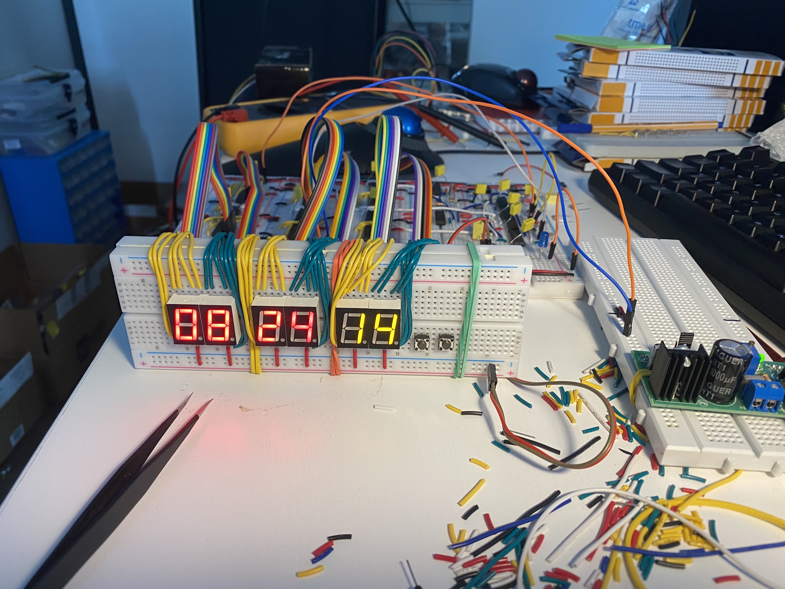
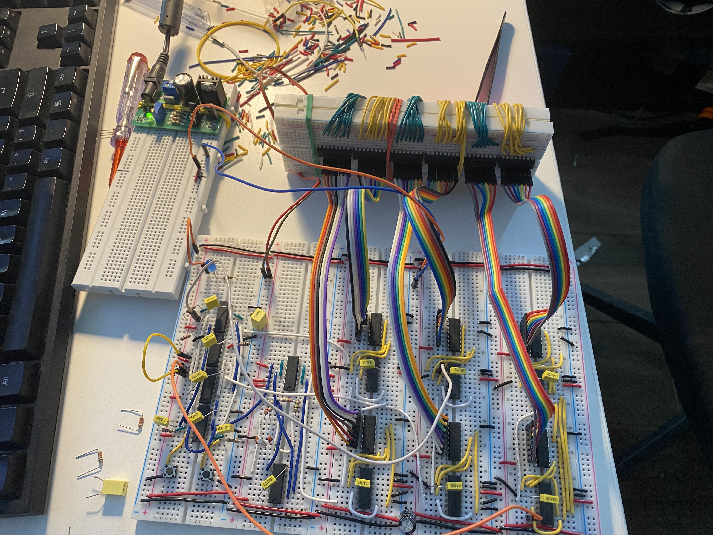

This is still work in progress. Schematics may contain bugs.

### Breadboard Digital Clock

This project is mix of two other projects:
1. A great [TTL Clock](http://www.ttlclock.com/)
2. [74xx ICs Based Digital Clock](http://www.malinov.com/Home/sergeys-projects/74xx-clock)

I just mixed these two projects.

This article was of great help: http://www.hackersbench.com/Projects/1Hz/

I plan to provide a detailed description how to build the clock
with explanation how it works soon.

### Some pictures

